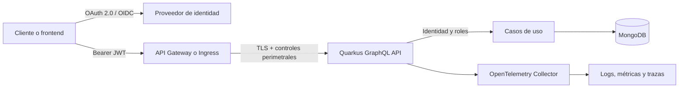

# Franchise API v1

Reactive API for managing franchises, branches and product stock.

## Technology stack

- Java 21
- Spring Boot
- Spring WebFlux
- MongoDB
- Docker
- Terraform
- Render

# Franchise API v1: evolución de seguridad, borrado lógico, rendimiento en EKS y FinOps

> Documento de diseño para incorporar gradualmente capacidades empresariales a **Franchise API v1** sin romper el backend REST existente ni el servicio GraphQL independiente.

## 1. Contexto actual

**Franchise API v1** es una API reactiva para administrar franquicias, sucursales y existencias de productos.

### Stack actual

- Java 21 y Spring Boot para `franchise-service`.
- Spring WebFlux y MongoDB reactivo.
- Docker, Terraform y Render.
- Servicio adicional por implementar `franchise-graphql-service` con Quarkus, Java 25 Amazon Corretto y Gradle 9.3.0.
- SmallRye GraphQL, MongoDB reactivo con Mutiny, Health, Micrometer/Prometheus, OpenTelemetry y logs JSON.
- Frontend estático por implementar `franchise-web`.

El servicio GraphQL compartirá las colecciones `franchises`, `branches` y `products` con el servicio REST. Por ello, 
cualquier cambio en el modelo persistido debe ser compatible entre ambos backends antes de habilitarse en producción.

## 2. Principios de evolución

1. **Compatibilidad primero:** REST y GraphQL deben interpretar de la misma forma los documentos activos y eliminados.
2. **Seguridad por defecto:** toda operación de negocio debe requerir identidad válida, salvo health checks estrictamente necesarios.
3. **Autorización en profundidad:** aplicar permisos tanto en el punto de entrada como en los servicios de aplicación.
4. **No bloquear el event loop:** evitar llamadas bloqueantes en rutas reactivas.
5. **Observabilidad como contrato:** métricas, logs y trazas deben incluir atributos técnicos y de negocio controlados.
6. **FinOps basado en evidencia:** correlacionar consumo, carga y costo antes de ajustar recursos.
7. **Configuración por ambiente:** local, CI, Render y EKS deben usar perfiles separados y secretos externos.

---

# 3. Borrado lógico

## 3.1 Objetivo

Reemplazar el borrado físico por una actualización de estado que conserve trazabilidad, permita restauración controlada y evite que un registro eliminado aparezca en consultas normales.

## 3.2 Modelo recomendado

Agregar a cada documento susceptible de eliminación:

```json
{
  "deleted": false,
  "deletedAt": null,
  "deletedBy": null,
  "deletionReason": null,
  "version": 1
}
```

### Semántica

- `deleted`: indicador principal para filtros e índices.
- `deletedAt`: fecha UTC del borrado lógico.
- `deletedBy`: identificador técnico del sujeto autenticado, no un nombre libre.
- `deletionReason`: motivo opcional, sanitizado y con longitud limitada.
- `version`: control de concurrencia optimista para evitar actualizaciones perdidas.

No se recomienda usar únicamente `deletedAt != null`, porque un booleano explícito simplifica filtros, índices parciales y validaciones.

## 3.3 Reglas de negocio

- Las consultas estándar retornan únicamente documentos con `deleted != true`.
- Un elemento ya eliminado debe producir una respuesta idempotente o un error de negocio estable, según el contrato aprobado.
- El borrado de una franquicia o sucursal no debe ejecutarse en cascada silenciosamente.
- Antes de eliminar un padre se debe elegir explícitamente una política:
    - rechazar si tiene hijos activos;
    - realizar cascada lógica transaccional o compensable;
    - ejecutar un proceso asíncrono con estado visible.
- La restauración debe validar nuevamente las restricciones de unicidad.
- El borrado físico queda reservado para una política de retención aprobada.

## 3.4 Cambios en el dominio Quarkus

Ejemplo conceptual para `Product`:

```java
public record Product(
        String id,
        String branchId,
        String name,
        int stock,
        boolean deleted,
        Instant deletedAt,
        String deletedBy,
        long version) {

    public Product softDelete(String actor, Instant now) {
        if (deleted) {
            return this;
        }
        return new Product(id, branchId, name, stock, true, now, actor, version + 1);
    }

    public Product restore() {
        return new Product(id, branchId, name, stock, false, null, null, version + 1);
    }
}
```

El dominio no debe depender de Quarkus, MongoDB ni de la identidad HTTP. El actor autenticado se obtiene en infraestructura y se entrega al caso de uso.

## 3.5 Puerto de persistencia

```java
public interface ProductRepository {
    Uni<Product> save(Product product);
    Uni<Product> findActiveById(String id);
    Uni<Product> findIncludingDeletedById(String id);
    Uni<Boolean> softDeleteById(String id, String actor, Instant deletedAt, long expectedVersion);
    Uni<Boolean> restoreById(String id, long expectedVersion);
}
```

No conservar `deleteById` como operación pública del caso de uso. Si aún se necesita para mantenimiento, ubicarlo en un puerto administrativo separado.

## 3.6 Filtros MongoDB

```java
private static Bson active() {
    return Filters.ne("deleted", true);
}

public Uni<Product> findActiveById(String id) {
    return collection.find(Filters.and(
            Filters.eq("_id", id),
            active()))
        .collect().first()
        .onItem().ifNotNull().transform(DocumentMapper::toProduct);
}
```

Para compatibilidad con documentos existentes, `deleted` ausente se interpreta como activo. Una migración posterior puede establecer `deleted=false` explícitamente.

## 3.7 Actualización atómica

```java
Bson filter = Filters.and(
        Filters.eq("_id", id),
        Filters.ne("deleted", true),
        Filters.eq("version", expectedVersion));

Bson update = Updates.combine(
        Updates.set("deleted", true),
        Updates.set("deletedAt", deletedAt),
        Updates.set("deletedBy", actor),
        Updates.inc("version", 1));
```

Si `modifiedCount == 0`, distinguir entre recurso inexistente, recurso ya eliminado y conflicto de versión.

## 3.8 Índices

Propuesta inicial, sujeta a validar con el volumen y las consultas reales:

```javascript
db.products.createIndex(
  { branchId: 1, name: 1 },
  {
    name: "branch_product_name_active_uq",
    unique: true,
    partialFilterExpression: { deleted: { $ne: true } }
  }
)

db.products.createIndex(
  { deleted: 1, deletedAt: 1 },
  { name: "product_deletion_retention_idx" }
)
```

Antes de reemplazar índices únicos existentes, ejecutar una migración controlada y verificar duplicados entre documentos activos.

## 3.9 Contrato GraphQL

```graphql
type Mutation {
  removeProduct(branchId: String!, productId: String!): DeletionResult!
  restoreProduct(productId: String!): Product!
}

type DeletionResult {
  id: String!
  deleted: Boolean!
  deletedAt: String!
}
```

El nombre `removeProduct` puede mantenerse temporalmente para compatibilidad, pero debe documentarse que ejecuta borrado lógico. Una evolución futura puede deprecarlo en favor de `archiveProduct` o `softDeleteProduct`.

## 3.10 Auditoría y retención

- Emitir un evento de auditoría por eliminación y restauración.
- Registrar `resourceType`, `resourceId`, `actorId`, `operation`, `timestamp`, `traceId` y resultado.
- No almacenar tokens, secretos ni datos personales innecesarios.
- La retención y eventual purga física deben definirse con Seguridad, Legal y Gobierno de Datos.
- Un TTL index solo debe utilizarse si está aprobada la eliminación física automática y el campo de expiración es independiente de `deletedAt`.

---

# 4. Seguridad de acceso al API

## 4.1 Arquitectura objetivo



En EKS, el proveedor, gateway, certificados, roles y políticas concretas deben homologarse con los estándares vigentes del Banco. Este documento no presupone nombres de realms, grupos, cuentas, namespaces ni secretos corporativos.

## 4.2 Autenticación

Usar OIDC/OAuth 2.0 con validación de bearer tokens mediante `quarkus-oidc`.

```gradle
implementation 'io.quarkus:quarkus-oidc'
```

```properties
quarkus.oidc.application-type=service
quarkus.oidc.auth-server-url=${OIDC_AUTH_SERVER_URL}
quarkus.oidc.client-id=${OIDC_CLIENT_ID}
quarkus.oidc.token.audience=${OIDC_AUDIENCE}
quarkus.oidc.roles.role-claim-path=${OIDC_ROLE_CLAIM_PATH:groups}
quarkus.http.auth.permission.public.paths=/q/health/live,/q/health/ready
quarkus.http.auth.permission.public.policy=permit
quarkus.http.auth.permission.api.paths=/graphql
quarkus.http.auth.permission.api.policy=authenticated
```

No incluir secretos ni llaves privadas en Git, imágenes Docker, variables de build o archivos `application.properties` versionados.

## 4.3 Autorización

Roles sugeridos:

- `franchise-reader`: consultas del catálogo.
- `franchise-writer`: creación, renombrado y actualización de stock.
- `franchise-delete`: borrado lógico.
- `franchise-admin`: restauración y consultas administrativas.

```java
@Mutation("removeProduct")
@RolesAllowed("franchise-delete")
public Uni<DeletionResult> removeProduct(...) {
    // delega al caso de uso
}
```

Aplicar también la autorización al servicio de aplicación, evitando depender únicamente del resolver GraphQL.

## 4.4 Controles complementarios

- TLS externo y, si la plataforma lo exige, mTLS entre componentes.
- CORS con lista explícita por ambiente, nunca un patrón abierto en producción.
- Límites de tamaño del body y tiempos máximos.
- Rate limiting en gateway o ingress.
- Protección de introspección y GraphiQL en producción.
- Profundidad, complejidad, aliases y número de operaciones limitados en GraphQL.
- Consultas persistidas o allowlist para consumidores controlados.
- Encabezados de seguridad para el frontend.
- Gestión centralizada de secretos y rotación.
- Imágenes mínimas, usuario no root, filesystem de solo lectura cuando sea viable.
- SBOM, análisis de dependencias e imagen, firma y verificación en CI/CD.
- NetworkPolicies, mínimo privilegio IAM y separación por namespaces.

## 4.5 Configuración de GraphiQL

La configuración actual incluye GraphiQL en producción. La recomendación es deshabilitarlo por defecto:

```properties
quarkus.smallrye-graphql.ui.always-include=${GRAPHQL_UI_ENABLED:false}
```

Habilitarlo únicamente en entornos autorizados y detrás de autenticación.

## 4.6 Matriz mínima de pruebas de seguridad cumpliendo con algunas prácticas de OWASP

- Token ausente, expirado, issuer inválido y audience inválida.
- Rol insuficiente para cada mutation.
- Acceso permitido para cada rol esperado.
- Manipulación de `branchId` y `productId` para intentar acceso cruzado.
- Límites de profundidad y complejidad GraphQL.
- CORS desde origen permitido y no permitido.
- Ausencia de secretos y datos sensibles en logs, errores y trazas.
- Rate limit y comportamiento ante ráfagas.
- Dependencias e imagen sin vulnerabilidades críticas no aceptadas.

---

# 5. Preparación de rendimiento para EKS

## 5.1 Objetivo

Permitir que el servicio se pruebe y ajuste en un entorno EKS sin acoplar el código a un clúster específico. El script de rendimiento corporativo deberá integrarse después como automatización externa, usando parámetros y no valores embebidos.

## 5.2 Baseline antes de optimizar

Capturar por versión:

- throughput por operación GraphQL;
- latencia p50, p95 y p99;
- tasa de errores por código y operación;
- CPU y memoria usadas frente a requests/limits;
- conexiones, latencia y errores MongoDB;
- tiempo de arranque y readiness;
- tamaño de respuesta y complejidad GraphQL;
- saturación del pool y event-loop blocking;
- réplicas, reinicios, OOMKilled y throttling.

## 5.3 Recursos Kubernetes iniciales

Los valores deben salir de pruebas, no de estimaciones. Plantilla:

```yaml
resources:
  requests:
    cpu: "${CPU_REQUEST}"
    memory: "${MEMORY_REQUEST}"
  limits:
    memory: "${MEMORY_LIMIT}"
```

Evitar fijar inicialmente un límite de CPU demasiado agresivo que genere throttling. La decisión debe validarse con política de plataforma y resultados de carga.

## 5.4 Probes

```yaml
startupProbe:
  httpGet:
    path: /q/health/started
    port: http
  failureThreshold: 30
  periodSeconds: 5

readinessProbe:
  httpGet:
    path: /q/health/ready
    port: http
  periodSeconds: 10

livenessProbe:
  httpGet:
    path: /q/health/live
    port: http
  periodSeconds: 10
```

La liveness probe no debe depender de MongoDB; la readiness sí puede retirar temporalmente el pod del tráfico cuando una dependencia crítica no está disponible.

## 5.5 Autoscaling

- HPA basado inicialmente en CPU y, cuando exista una métrica confiable, en latencia, concurrencia o tasa de solicitudes.
- PodDisruptionBudget para proteger disponibilidad durante mantenimientos.
- topology spread constraints para distribuir réplicas.
- Cluster Autoscaler o Karpenter según el estándar de plataforma.
- VPA en modo recomendación antes de permitir cambios automáticos.

## 5.6 JVM y contenedor

El Dockerfile actual usa Java 21 posterior se actualizará a Java 25 Amazon Corretto y `MaxRAMPercentage`. Mantener:

```bash
-XX:MaxRAMPercentage=75
-XX:+ExitOnOutOfMemoryError
```

No añadir opciones de GC sin pruebas comparables. Registrar versión de JDK, flags, recursos del pod, dataset, duración y perfil de carga para que los resultados sean reproducibles.

## 5.7 Integración futura del script de performance

Contrato propuesto:

```bash
./performance-eks.sh \
  --environment qa \
  --namespace franchise-performance \
  --base-url "$BASE_URL" \
  --scenario catalog-read \
  --vus 50 \
  --duration 10m \
  --run-id "$GITHUB_RUN_ID"
```

El script debe:

1. validar contexto de AWS y Kubernetes;
2. bloquear producción salvo aprobación explícita;
3. etiquetar ejecución, pods y telemetría con `run.id`, `scenario`, `environment` y `service.version`;
4. aplicar manifiestos con dry-run previo;
5. ejecutar calentamiento y prueba medible por separado;
6. capturar resultados de carga y snapshots de recursos;
7. cancelar y limpiar recursos aunque ocurra un error;
8. no imprimir tokens, kubeconfig ni secretos;
9. producir un reporte JSON/Markdown consumible por CI;
10. asociar cada ejecución con commit, imagen y configuración.

## 5.8 Quality gates orientativos

Los umbrales no deben inventarse. El equipo debe aprobar valores por operación y ambiente para:

- error rate máximo;
- p95 y p99 máximos;
- utilización sostenida de CPU y memoria;
- reinicios y OOMKilled igual a cero;
- ausencia de event-loop blocking;
- costo máximo por escenario o por mil operaciones.

---

# 6. Observabilidad preparada para FinOps

## 6.1 Señales existentes aprovechables

El servicio ya contempla:

- Health en `/q/health`;
- métricas Prometheus en `/q/metrics`;
- trazas OpenTelemetry exportables por OTLP;
- logs JSON con `traceId` y `spanId`;
- métrica de mutaciones GraphQL cuando se implemente el nuevo Backend.

## 6.2 Convenciones OpenTelemetry

Atributos recomendados, con cardinalidad controlada:

```text
service.name=franchise-graphql-service
service.version=<git-sha-or-release>
deployment.environment.name=<dev|qa|prod>
k8s.namespace.name=<namespace>
k8s.deployment.name=<deployment>
cloud.provider=aws
cloud.region=<region>
franchise.operation=<operation-limited-set>
performance.run.id=<run-id-only-during-tests>
```

No usar `franchiseId`, `branchId`, `productId`, nombres de usuario o rutas con IDs como etiquetas de métricas. Estos valores generan alta cardinalidad y aumentan costo.

## 6.3 Métricas FinOps de aplicación

```text
franchise_graphql_requests_total{operation,result}
franchise_graphql_request_duration_seconds{operation}
franchise_graphql_mutations_total{operation,result}
franchise_mongodb_operation_duration_seconds{collection,operation,result}
franchise_performance_runs_total{scenario,result}
franchise_processed_items_total{operation}
```

Para servicios AWS cobrados por uso, instrumentar además unidades facturables reales, por ejemplo solicitudes, páginas, bytes o tokens, según corresponda. No estimar costos solo con CPU del pod.

## 6.4 Relación costo-uso

Modelo recomendado:

```text
Costo unitario = costo asignado del periodo / unidades de negocio procesadas
```

Ejemplos:

- costo por 1.000 operaciones GraphQL;
- costo por ejecución de performance;
- costo por franquicia consultada, si representa una unidad útil y estable;
- costo de observabilidad por GB de logs, métricas y trazas.

La atribución debe combinar etiquetas AWS/Kubernetes, métricas de aplicación, ventana temporal y `run.id`. Si la evidencia no permite atribución exacta por deployment, el reporte debe declararlo, no repartir el costo arbitrariamente.

## 6.5 Controles de costo de telemetría

- Retención diferenciada por ambiente y tipo de señal.
- Sampling de trazas configurable, preservando errores y pruebas controladas.
- Filtrado de health checks y ruido conocido.
- Restricción de cardinalidad en métricas.
- Niveles de log por ambiente y reducción de payloads.
- Dashboards con volumen ingerido, series activas y tasa de spans.
- Alertas de crecimiento anómalo de telemetría.

## 6.6 Dashboard mínimo

Paneles:

1. solicitudes, errores y latencia por operación;
2. CPU, memoria, throttling, reinicios y réplicas;
3. GC, heap, threads y event-loop;
4. MongoDB: latencia, errores y conexiones;
5. logs, métricas y trazas ingeridos;
6. ejecuciones performance por `run.id`;
7. costo total y costo unitario;
8. comparación de versión actual frente a baseline.

---

# 7. Roadmap recomendado en el caso hipotético de empezar con las mejoras

## Fase 1: contrato y compatibilidad

- Crear el plan para el borrado lógico.
- Definir comportamiento REST y GraphQL.
- Agregar campos compatibles y lectura de documentos legados.
- Añadir pruebas unitarias, integración y migración de índices.

## Fase 2: seguridad del API

- Integrar `quarkus-oidc`.
- Definir matriz de roles y scopes.
- Proteger mutations y servicios de aplicación.
- Cerrar GraphiQL e introspección según ambiente.
- Incorporar pruebas negativas y escaneo en CI.

## Fase 3: plataforma EKS

- Crear manifests o Helm/Kustomize por ambiente.
- Configurar probes, requests, PDB, distribución y HPA.
- Externalizar secretos.
- Homologar ingress, TLS, identity e IAM con plataforma Banco.

## Fase 4: performance reproducible

- Adaptar el script corporativo al contrato parametrizado.
- Definir escenarios, dataset, warm-up y gates.
- Publicar resultados y telemetría con `run.id`.
- Establecer baseline por versión.

## Fase 5: FinOps

- Asegurar tagging y asignación de costos.
- Medir unidades de negocio y telemetría.
- Crear dashboard de costo unitario.
- Automatizar detección de regresiones de precio/rendimiento.

---

# 8. Definition of Done DOD en el caso Banco

Las capacidades se considerarán listas cuando:

- existe contrato documentado y compatible;
- tiene pruebas unitarias, integración y seguridad;
- no introduce operaciones bloqueantes;
- produce métricas, logs y trazas útiles sin alta cardinalidad;
- no expone secretos ni información sensible;
- tiene configuración por ambiente;
- pasa performance gates aprobados;
- puede atribuir su consumo con evidencia;
- incluye estrategia de rollback;
- cuenta con aprobación de los responsables corporativos cuando aplique.

---

# 9. Decisiones pendientes

1. Política exacta de cascada para franquicia, sucursal y producto.
2. Retención antes de purga física.
3. Proveedor OIDC, claims y roles homologados.
4. Gateway/Ingress y mecanismo de rate limiting.
5. Reglas corporativas para GraphQL UI e introspección.
6. Herramienta de carga y contenido del script de performance de EKS.
7. Umbrales SLO y performance gates.
8. Fuente oficial de costos y esquema de asignación.
9. Retención y sampling de telemetría por ambiente.
10. Estrategia de migración coordinada para REST Java 21 y GraphQL Quarkus Java 25.

---