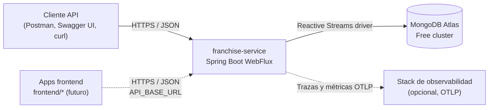
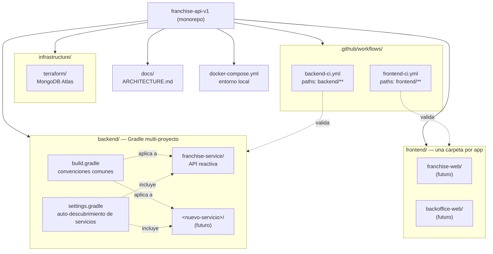
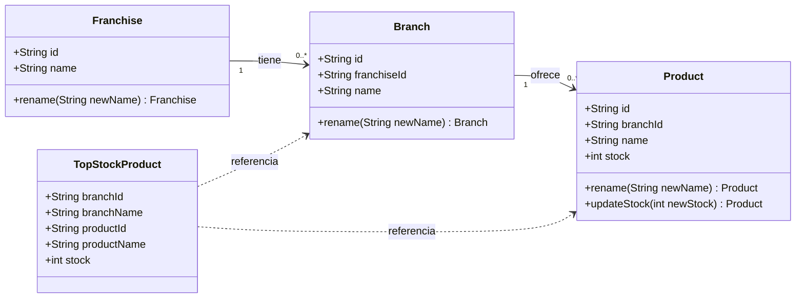
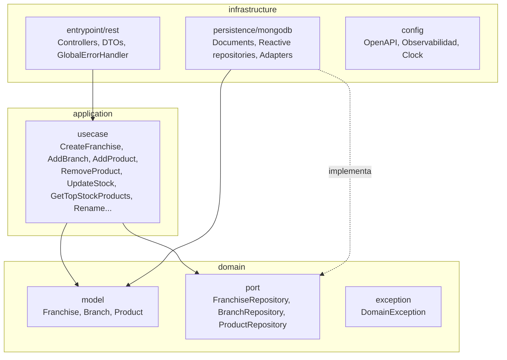
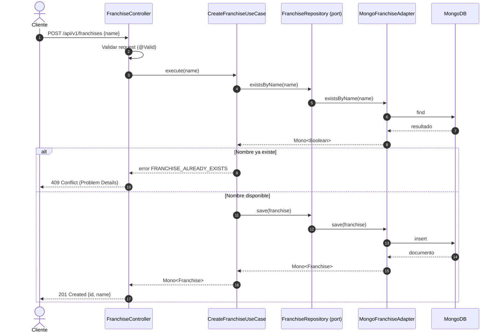
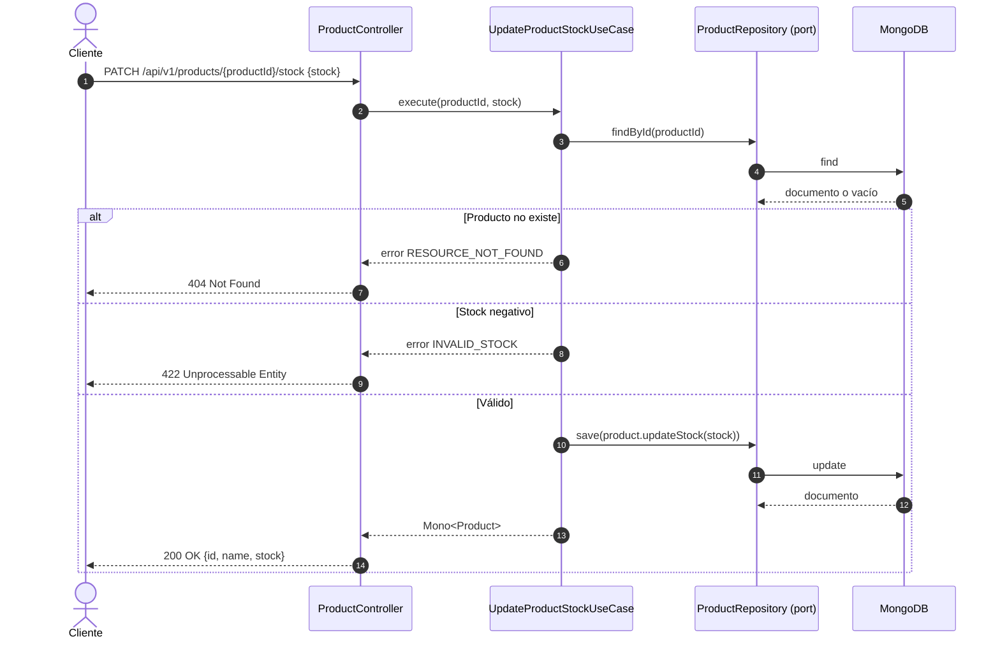
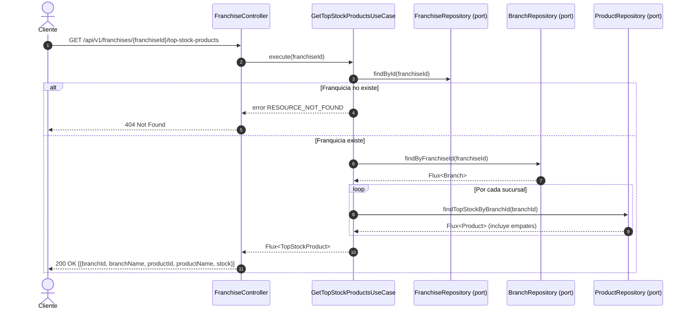
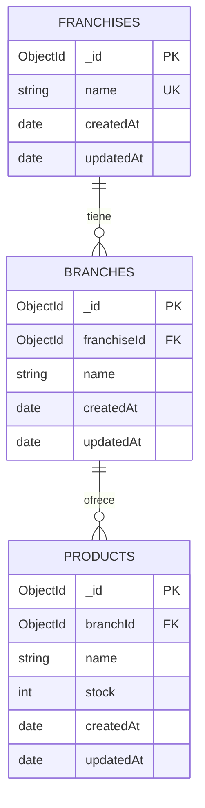
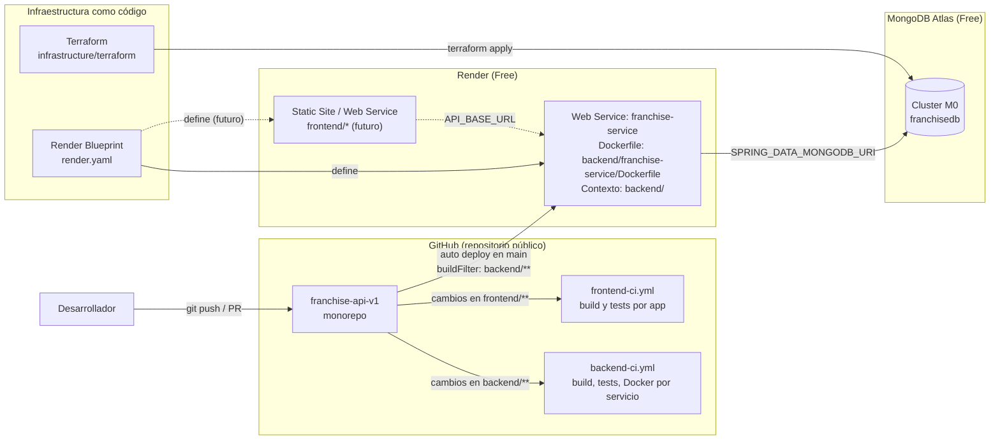

# Franchise API – Diseño y planeación

Este documento recoge el diseño previo a la implementación: alcance, organización del monorepo, modelo de dominio, arquitectura, flujos principales, persistencia, despliegue y estrategia de trabajo con Git.

> Los diagramas usan Mermaid y GitHub los renderiza directamente.

---

## 1. Alcance y requisitos

| # | Requisito | Tipo | Endpoint |
|---|---|---|---|
| 1 | Proyecto en Spring Boot | Obligatorio | — |
| 2 | Agregar franquicia | Obligatorio | `POST /api/v1/franchises` |
| 3 | Agregar sucursal a una franquicia | Obligatorio | `POST /api/v1/franchises/{franchiseId}/branches` |
| 4 | Agregar producto a una sucursal | Obligatorio | `POST /api/v1/branches/{branchId}/products` |
| 5 | Eliminar producto de una sucursal | Obligatorio | `DELETE /api/v1/branches/{branchId}/products/{productId}` |
| 6 | Modificar stock de un producto | Obligatorio | `PATCH /api/v1/products/{productId}/stock` |
| 7 | Producto con más stock por sucursal de una franquicia | Obligatorio | `GET /api/v1/franchises/{franchiseId}/top-stock-products` |
| 8 | Persistencia en la nube | Obligatorio | MongoDB Atlas |
| E1 | Empaquetado con Docker | Extra | — |
| E2 | Programación reactiva | Extra | WebFlux + Reactive MongoDB |
| E3 | Actualizar nombre de franquicia | Extra | `PATCH /api/v1/franchises/{franchiseId}/name` |
| E4 | Actualizar nombre de sucursal | Extra | `PATCH /api/v1/branches/{branchId}/name` |
| E5 | Actualizar nombre de producto | Extra | `PATCH /api/v1/products/{productId}/name` |
| E6 | Persistencia como IaC | Extra | Terraform (MongoDB Atlas) |
| E7 | Solución desplegada en la nube | Extra | Render + MongoDB Atlas |

### Decisiones y supuestos

| Tema | Decisión |
|---|---|
| Stock | Entero mayor o igual a 0 |
| Nombres | Obligatorios, sin espacios al inicio o al final, únicos dentro de su padre |
| Empate en mayor stock | Se retornan todos los productos empatados de la sucursal |
| Sucursal sin productos | No aparece en el resultado del endpoint 7 |
| Eliminación de producto | Se valida que el producto pertenezca a la sucursal indicada |
| Errores | RFC 9457 (Problem Details) con un `code` estable |

---

## 2. Contexto del sistema



---

## 3. Organización del monorepo

El repositorio separa backend, frontend e infraestructura para que cada parte crezca y se despliegue de forma independiente.



```text
franchise-api-v1/
├── backend/
│   ├── build.gradle                  # Java 21, JaCoCo, JUnit para todos los servicios
│   ├── settings.gradle               # incluye toda carpeta con build.gradle
│   ├── gradlew, gradle/
│   └── franchise-service/
│       ├── build.gradle              # dependencias del servicio
│       ├── Dockerfile                # contexto de build: backend/
│       └── src/
├── frontend/                         # una carpeta por app (package.json + Dockerfile)
├── infrastructure/terraform/
├── docs/ARCHITECTURE.md
├── .github/workflows/
│   ├── backend-ci.yml
│   └── frontend-ci.yml
├── docker-compose.yml
└── render.yaml
```

| Necesidad | Cómo se resuelve |
|---|---|
| Agregar un servicio backend | Crear `backend/<servicio>/build.gradle`; Gradle lo incluye automáticamente |
| Agregar una app frontend | Crear `frontend/<app>/package.json`; el CI la detecta automáticamente |
| Configuración común | Centralizada en `backend/build.gradle` |
| CI eficiente | Cada workflow corre solo si cambian sus rutas |
| Despliegue independiente | Cada servicio o app tiene su propio `Dockerfile` |

---

## 4. Modelo de dominio



Reglas del dominio:

- `stock` nunca puede ser negativo.
- Las entidades son inmutables: `rename` y `updateStock` retornan una nueva instancia.
- El dominio no depende de Spring ni de MongoDB.

---

## 5. Arquitectura limpia



Reglas de dependencia (validadas con ArchUnit en `CleanArchitectureTest`):

| Capa | Puede depender de | No puede depender de |
|---|---|---|
| `domain` | Java, Reactor | `application`, `infrastructure`, Spring |
| `application` | `domain` | `infrastructure` |
| `infrastructure.entrypoint` | `application`, `domain` | `infrastructure.persistence` |
| `infrastructure.persistence` | `domain` | `infrastructure.entrypoint` |

### Estructura de paquetes

Ubicación: `backend/franchise-service/src/main/java/`

```text
com.andresyfr.franchise
├── domain
│   ├── model
│   ├── exception
│   └── port
├── application
│   └── usecase
└── infrastructure
    ├── config
    ├── entrypoint/rest
    │   └── error
    └── persistence/mongodb
```

---

## 6. Flujos principales

### 6.1 Crear franquicia



### 6.2 Modificar stock de un producto



### 6.3 Producto con más stock por sucursal



---

## 7. Persistencia (MongoDB)

Se usan colecciones separadas en lugar de un único documento embebido. Así se evita que el documento de la franquicia crezca sin límite y las actualizaciones de stock o de nombres afectan un solo documento.



| Colección | Índice | Propósito |
|---|---|---|
| `franchises` | `{ name: 1 }` único | Evitar franquicias duplicadas |
| `branches` | `{ franchiseId: 1, name: 1 }` único | Listar sucursales y evitar duplicados por franquicia |
| `products` | `{ branchId: 1, name: 1 }` único | Evitar productos duplicados por sucursal |
| `products` | `{ branchId: 1, stock: -1 }` | Obtener rápido el mayor stock por sucursal |

---

## 8. Despliegue



| Componente | Herramienta | Administrado por |
|---|---|---|
| Base de datos | MongoDB Atlas M0 | Terraform (`infrastructure/terraform`) |
| Backend | Render Free (Docker) | `render.yaml` |
| Frontend (futuro) | Render Static Site | `render.yaml` |
| Secretos | Variables de entorno en Render | Panel de Render (no se versionan) |
| CI | GitHub Actions | `backend-ci.yml` y `frontend-ci.yml` |
